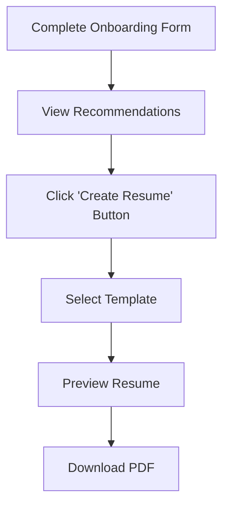

# Resume Creation Module

## Overview
The Resume Creation module allows users to generate professional CVs from their onboarding data. Users can choose from multiple templates and download their resume as a PDF.

## Features

### 1. **Multiple CV Templates**
- **Modern Pro**: Clean and professional design with blue accent colors
- **Classic Formal**: Traditional layout perfect for corporate roles
- **Creative Bold**: Stand out with a vibrant purple/pink design
- **Minimal Clean**: Simple and elegant with green accents and plenty of white space

### 2. **Data Mapping**
All data from the onboarding form is automatically mapped to the resume:
- **Profile Information**: Name, email, phone, location, summary
- **Professional Links**: LinkedIn, GitHub, Portfolio
- **Skills**: All user skills displayed prominently
- **Experience**: Company, role, duration, and descriptions
- **Education**: Degree, institution, years, and GPA
- **Projects**: Project names, descriptions, and links
- **Certifications**: Certificate names, issuers, and dates

### 3. **User Flow**



## Implementation Details

### Frontend Components

#### Resume Page (`/resume`)
Location: `frontend/src/app/resume/page.tsx`

- Fetches user profile data from sessionStorage or backend
- Displays 4 template options with color-coded previews
- Shows real-time preview of selected template
- Handles PDF download

#### Recommendations Page Update
Location: `frontend/src/app/recommendations/page.tsx`

- Added "Create Resume" button next to "Browse Job Listings" button
- Links to `/resume` page

### Backend Routes

#### Resume Generation Endpoint
Location: `backend/routes/resume_routes.py`

- **Endpoint**: `/generate-resume`
- **Method**: POST
- **Payload**:
```json
{
  "template": "modern",
  "profile": {
    "name": "John Doe",
    "email": "john@example.com",
    "skills": ["Python", "JavaScript"],
    // ... other profile data
  }
}
```

- **Response**: PDF file download
- **Templates Available**:
  - `modern` - Modern Pro template
  - `classic` - Classic Formal template
  - `creative` - Creative Bold template
  - `minimal` - Minimal Clean template

### Dependencies

#### Backend
- `reportlab`: PDF generation library

Added to `backend/requirements.txt`:
```
reportlab
```

#### Frontend
- No additional dependencies required
- Uses existing Lucide React icons

## Usage

### For Users

1. Complete the onboarding form with your information
2. Navigate to the Recommendations page
3. Click the **"Create Resume"** button (green button next to Browse Job Listings)
4. Select your preferred template from the options
5. Preview your resume in real-time
6. Click **"Download Resume"** to get your PDF

### For Developers

#### Installing Backend Dependencies
```bash
cd backend
pip install -r requirements.txt
```

#### Starting the Application
```bash
# Backend
cd backend
python app.py

# Frontend
cd frontend
npm run dev
```

#### Testing the Resume Generation
1. Ensure backend is running on `http://localhost:5000`
2. Ensure frontend is running on `http://localhost:3000`
3. Complete onboarding form
4. Navigate to `/resume` page
5. Select a template and download

## Template Customization

Each template can be customized in `backend/routes/resume_routes.py`:

### Adding a New Template

1. Create a new function in `resume_routes.py`:
```python
def create_your_template(profile_data, buffer):
    # Your template implementation
    pass
```

2. Add template metadata to frontend `frontend/src/app/resume/page.tsx`:
```typescript
const templates: Template[] = [
  // ... existing templates
  {
    id: "your_template",
    name: "Your Template Name",
    description: "Your template description",
    color: "from-color-500 to-color-600"
  }
];
```

3. Add template handler in `generate_resume()` endpoint:
```python
elif template == 'your_template':
    create_your_template(profile, buffer)
```

## API Documentation

### POST /generate-resume

Generates a PDF resume based on the selected template and user profile.

**Request Headers:**
```
Content-Type: application/json
```

**Request Body:**
```json
{
  "template": "modern|classic|creative|minimal",
  "profile": {
    "name": "string",
    "email": "string",
    "phone": "string",
    "location": "string",
    "summary": "string",
    "github": "string",
    "linkedin": "string",
    "portfolio": "string",
    "skills": ["string"],
    "education": [{
      "degree": "string",
      "institution": "string",
      "startYear": "string",
      "endYear": "string",
      "gpa": "string"
    }],
    "experience": [{
      "company": "string",
      "role": "string",
      "duration": "string",
      "description": "string"
    }],
    "projects": [{
      "name": "string",
      "description": "string",
      "link": "string"
    }],
    "certificates": [{
      "name": "string",
      "issuer": "string",
      "issueDate": "string",
      "expiryDate": "string"
    }]
  }
}
```

**Response:**
- **Success (200)**: PDF file download
- **Error (400)**: Missing profile data
- **Error (500)**: Resume generation failed

**Example:**
```bash
curl -X POST http://localhost:5000/generate-resume \
  -H "Content-Type: application/json" \
  -d '{
    "template": "modern",
    "profile": {...}
  }' \
  --output resume.pdf
```

## Troubleshooting

### Issue: "Profile data not found"
- **Solution**: Complete the onboarding form first or check if sessionStorage has data

### Issue: "Failed to generate resume"
- **Solution**: Check backend logs for errors, ensure reportlab is installed

### Issue: PDF download doesn't start
- **Solution**: Check browser console for errors, verify CORS settings, ensure backend is running

### Issue: Template preview not showing
- **Solution**: Verify user profile data is loaded, check browser console for errors

## Future Enhancements

1. **Additional Templates**: Add more professional templates (e.g., Academic, Tech-focused)
2. **Custom Colors**: Allow users to customize template colors
3. **Multiple Languages**: Support for resumes in different languages
4. **ATS Optimization**: Add ATS-friendly resume formats
5. **Template Preview Images**: Show actual template screenshots before selection
6. **Resume Analytics**: Track which sections are most effective
7. **Export Formats**: Support for Word, HTML, and Markdown formats
8. **Resume Editor**: Allow inline editing before download
9. **Version History**: Save and manage multiple resume versions
10. **AI Suggestions**: Provide AI-powered content suggestions for improvement

## Related Files

### Frontend
- `frontend/src/app/resume/page.tsx` - Main resume page
- `frontend/src/app/recommendations/page.tsx` - Added resume button
- `frontend/src/components/MultiStepResumeForm.tsx` - Onboarding form

### Backend
- `backend/routes/resume_routes.py` - Resume generation routes
- `backend/app.py` - Blueprint registration and CORS
- `backend/requirements.txt` - Added reportlab dependency

## Contributing

When adding new features:
1. Follow existing code patterns
2. Update this documentation
3. Test all templates thoroughly
4. Ensure responsive design on preview
5. Validate PDF generation for edge cases

## License

This module is part of the JobSwipe application.
